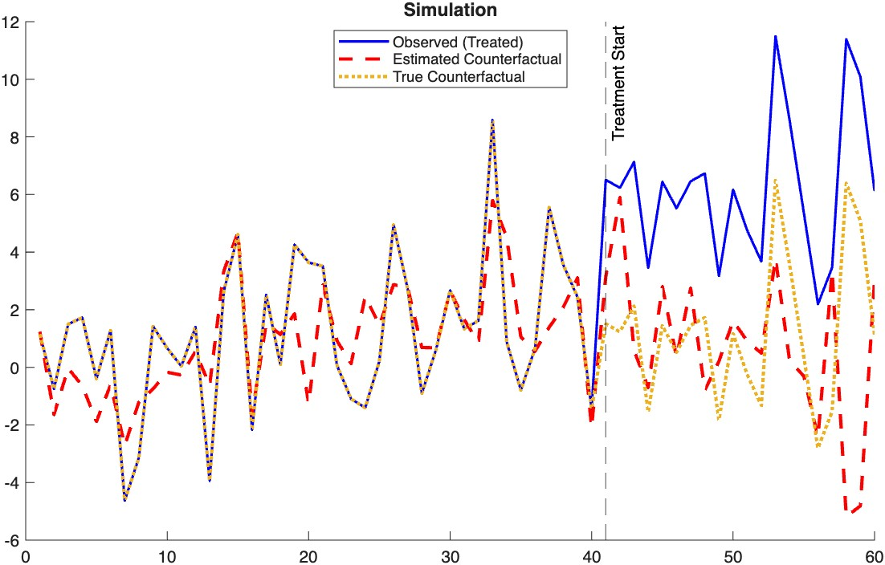
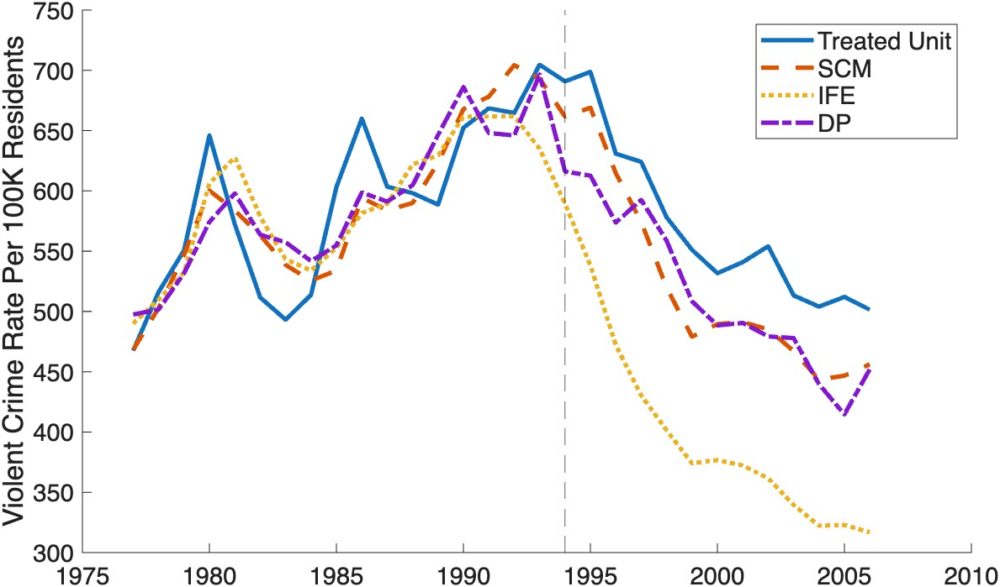

# ATEL Toolbox: Average Treatment Effect Localization
[](https://opensource.org/licenses/MIT)


The **ATEL Toolbox** provides a MATLAB implementation for estimating counterfactuals in panel data settings with single treated unit (first unit). It is designed for estimating the Average Treatment Localization Effect (ATEL) on the Treated.

The estimation framework includes:
* **Diversified Projection (DP)** for factor estimation.
* **Local Linear estimator** for time-varying factor loadings.

## Overview
This package implements the method developed in:

> Ruei-Chi Lee (2026). "Average Treatment Effect Localization: Projection Methods in Synthetic Control"


## Main Function: `atel`

The primary function for estimating the ATEL is `atel`.

### Syntax
```matlab
results = atel(Y, X, T0)
results = atel(Y, X, T0, Name, Value)
```
### Inputs
* **`Y`** *(Matrix*, $N \times T$): The outcome variable. **Crucial:** The first row (`Y(1,:)`) must correspond to the **treated unit**.
* **`X`** *(Array*, $N \times T \times P$): The covariate matrix.
* **`T0`** *(Integer)*: The length of the pre-treatment period. The treatment is assumed to start at $T_0 + 1$.

### Optional Arguments (Name-Value Pairs)
You can customize the estimation by passing these options:

* **`'Rank'`** *(Integer)*: The number of latent factors ($J$).
  * *Default:* 2.
* **`'Bandwidth'`** *(Scalar)*: The kernel bandwidth ($h$).
  * *Default:* Automatically selected via Cross-Validation.
* **`'Basis'`** *(String)*: The sieve basis for the loadings. 
  *  *Options:* `'bspline'` (default) ,`'polynomial'` or `'trigonometric'`.
* **`'Alpha'`** *(Scalar)*: Significance level.
  * *Default:* 0.05 (for 95% CI.)

### Outputs
The function returns a struct `results` containing:

* **`results.atel`**: The estimated Average Treatment Localization Effect (ATEL).
* **`results.Y1_hat`**: The estimated counterfactual outcome path.
* **`results.se`**: The standard error of the estimate.
* **`results.ci`**: The 95% pointwise confidence interval `[lower, upper]`.
* **`results.p_val`**: The p-value testing the null hypothesis of no effect.


## Installation

1. Download or clone this repository.
2. Open MATLAB and navigate to the package folder.
3. Run the installation script to add all necessary subfolders (including `src`, `example`, and `test`) to your path:
   ```matlab
   install
    ```


## Quick Start
To verify that the toolbox is working correctly and to see a demonstration of the estimator, run the built-in simulation test immediately after installation.

### 1. Run the Simulation
This script generates data with a known treatment effect, estimates the counterfactual using ATEL, and compares the result to the truth.

 ```matlab
 test_simulation
 ```

### 2. Code inside Simulation
Here is the core logic used in the test_simulation. This demonstrates how to format your data and apply the atel estimator.

```matlab
% Inputs:
%   Y  : N x T outcomes
%   X  : N x T x P (or N x T) covariates for constructing weights
%   T0 : pre-treatment length
%   opts : optional tuning parameters (J, bandwidth, kernel, basis choice, etc.)

% Note: We feed the simulated y and X. The function handles the rest.

Rank = J_true; % fix Rank=J_true for this test.
basis = 'bspline'; % 'bspline', 'polynomial', or 'trigonometric'
alpha = 0.05; % Significance level (e.g., 0.05 for 95% CI).

results = atel(y, X, T0, ...
               'Rank', Rank, ...
               'Basis', basis, ...
               'Alpha', alpha, ...
               'Bandwidth', []); % Auto-select bandwidth via CV

% Outputs (example)

fprintf('\n-----------------------------------------\n');
fprintf('True Effect:      %.4f\n', true_atel);    % true ATEL
fprintf('Estimated (ATEL): %.4f\n', results.atel); % scalar ATEL
fprintf('95%% CI:              [%.4f, %.4f]\n', results.ci(1), results.ci(2)); % (1-alpha)% CI
fprintf('P-value:             %.4f\n', results.p_val); % p_value under alpha significance level
fprintf('-----------------------------------------\n');

```


### 2. Expected Output
You should see the following output:

```
Running ATEL Simulation Test...

-----------------------------------------
True Effect:      4.7992
Estimated (ATEL): 4.3148
95% CI:           [3.2430, 5.3866]
P-value:          0.0000
-----------------------------------------
```
### 3. Visualization
The script generates a plot comparing the Estimated Counterfactual against the True Counterfactual. A successful test shows these lines overlapping closely.



## Empirical application: Arizona Right-to-Carry Laws on violent crime

This section reproduces the results in Section 5 of the paper. We estimate the ATEL of "Right-to-Carry" (RTC) laws on violent crime rates in Arizona, particularly with $J=2$

This serves as a benchmark comparison against standard Synthetic Control (SCM) and Interactive Fixed Effects (IFE) estimators.

### 1. Run the Replication Script
```matlab
demo_arizona_rtc
```
### 2. Expected Output (Table 4 & 5)
The script will output the estimated Average Treatment Localization Effect (ATEL) for Arizona, along with standard errors and p-value, providing a comparison with the Interactive Fixed Effects (IFE) estimator.

```text
--- Estimation Results (Table 4) ---
Number of Factors (J): 2
ATEL Estimate:       49.7665
Standard Error:      15.0055
95% CI:              [20.3562, 79.1767]
P-value:             0.0069

=======================================================
             Table 5: Method Comparison                
=======================================================
 Method       | Estimate   | Std. Err   | p-value    
-------------------------------------------------------
 ATEL         |    49.7665 |    15.0055 |     0.0069 
 IFE          |   153.5546 |    40.1636 |     0.0024 
```

### 3. Visualization (Figure 2 & 3)
The script generates a comparison plot (Figure 3 and 4 in the paper) showing the trajectories of the Observed outcome, Synthetic Control (SCM), Interactive Fixed Effects (IFE), and the proposed ATEL method.





*(Note: The figure above shows the clear divergence of the ATEL estimate from the synthetic control baseline after the intervention).*


## Directory Structure
* **`src/`**: Core source code (`atel.m`, utilities).
  * **`src/IFE/`**: Interactive Fixed Effects module.
  * **`src/SC/`**: Synthetic Control module.
* **`example/`**: Demo scripts (`demo_arizona_rtc.m`) and datasets.
* **`tests/`**: Unit tests and simulation checks (`test_simulation.m`).
* **`Figure/`**: Contains documentation images.

## License
MIT License - see [LICENSE](LICENSE.txt) file for details.

## Contact
Maintainer: Ruei-Chi Lee  
For questions/bug reports: rl824@economics.rutgers.edu
